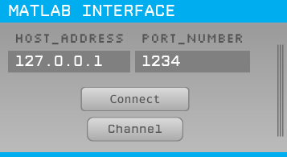
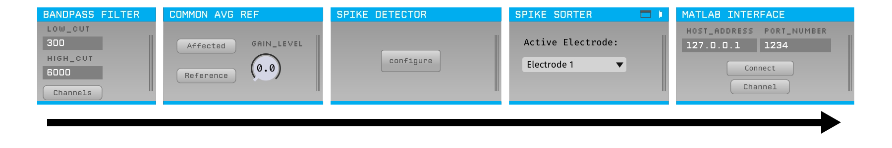

# Matlab Interface



Streams channel and spike_id information of all sorted spikes from open-ephys to matlab. The major application of the present plugin is my custom-made matlab-based close-loop BCI algorithm. It may also help with spike-oriented live processing.


## Installation

(Coming soon)


## Usage

Once installed, the plugin will appear as 'Matlab Interface' in the 'Filters' section of the 'Processor List' of the Open Ephys GUI. The plugin can be placed after any source, filter, or sink in the signal chain and will stream the data output by the preceding processor into your Matlab session. A 'Spike Sorter' must be upstream of 'Matlab Interface', otherwise fatal errors shall arise. Signal chain like below shall work properly:



Before starting data acquisition, you will need to press the 'Connect' button in the editor to initiate a connection between the plugin and your Matlab session. The plugin will open a socket using the IP and Port address listed in the Matlab Interface editor.

To initialize the connection on the Matlab side, you will need to call your generated script from Matlab following the instructions below. Once the connection has been initiated on both sides, pressing the Play button in the Open Ephys GUI will automatically stream the incoming data to Matlab, and then back to the GUI for further processing. 

### Matlab API

In order to process the incoming data in Matlab, you will need to leverage the included Matlab API. The API was designed specifically to introduce/reinforce object-oriented programming and to encourage Matlab evangelists to consider developing plugins in C++. 

The Matlab API is centered around a `GenericProcessor` class that encapsulates an Open Ephys data processor. The idea is to write your own class that inherits and extends `GenericProcessor`. A starting template is included below: 

```matlab
classdef MyClass < GenericProcessor

    properties
        %define any variables you want to keep track of here (see examples)
    end

    methods 
        function self = Plotter(host, port)
            self = self@GenericProcessor(host, port);
            %Initialize any variables here (see examples)
            self.process();
        end
    end

    methods (Access = protected)
        function process(self)
            while (true) 
                process@GenericProcessor(self); 
                numSamples = self.dataIn.numSamplesFetched;
                data = self.dataIn.continuous(1:end);
                %Do whatever you want with the data here (see examples)
            end
        end
    end
end
```

Once you have designed your class, you can call it from the Matlab command window using `MyClass(host,port)`, where host and port need to match the entries specified in the MatlabEngine editor in the OpenEphys GUI. 

However, for those who are not familiar with object-oriented programming of matlab, simple scripts are available using the API provided. Here is an example that prints information of every spike every 50ms:

```matlab
host='127.0.0.1'
port=1234
processor=GenericProcessor(host, port);

cycle_duration=0.05 %50ms cycle

timeall=tic();
while 1
    timet=tic();
	
    data=[];	
    t=processor.process();
    if ~isempty(t)
        t=split(t,' ');
        for i=1:length(t)-1
            % For some unknown reason, there are some garbled codes in the data received for the first time
            % If your system language is CHINESE, such codes are presented in the form of '屯'
            % For users of other languages, you may experiment yourself
            % For formal use, simply discard the data obtained the first time
            if ~isempty(t{i}) && t{i}(1)~='屯' 
                tt=split(t{i},'+');
                data=[data;str2double(tt(1)),str2double(tt(2))];
            end
        end
    end
	
    if ~isempty(data)
        data
    end
	
    while toc(timet)<cycle_duration;   end
	
    toc(timeall)
end
```


## Building from source

First, follow the instructions on [this page](https://open-ephys.github.io/gui-docs/Developer-Guide/Compiling-the-GUI.html) to build the Open Ephys GUI.

**Important:** This plugin is intended for the latest version of open-ephys GUI (**0.6.0**). 

Then, clone this repository into a directory at the same level as the `plugin-GUI`, e.g.:
 
```
Code
├── plugin-GUI-master
│   ├── Build
│   ├── Source
│   └── ...
├── OEPlugins
│   └── matlab-interface
│       ├── Build
│       ├── Source
│       └── ...
```

### Windows

**Requirements:** [Visual Studio](https://visualstudio.microsoft.com/) and [CMake](https://cmake.org/install/)

From the `Build` directory, enter:

```bash
cmake -G "Visual Studio 17 2022" -A x64 ..
```

Next, launch Visual Studio and open the `OE_PLUGIN_matlab-interface.sln` file that was just created. Select the appropriate configuration (Debug/Release) and build the solution.

Selecting the `INSTALL` project and manually building it will copy the `.dll` and any other required files into the GUI's `plugins` directory. The next time you launch the GUI from Visual Studio, the Matlab Interface plugin should be available.

**Warning:** Linux and macOS are not tested yet

### Linux

**Requirements:** [CMake](https://cmake.org/install/)

From the `Build` directory, enter:

```bash
cmake -G "Unix Makefiles" ..
cd Debug
make -j
make install
```

This will build the plugin and copy the `.so` file into the GUI's `plugins` directory. The next time you launch the GUI compiled version of the GUI, the Matlab Interface plugin should be available.


### macOS

**Requirements:** [Xcode](https://developer.apple.com/xcode/) and [CMake](https://cmake.org/install/)

From the `Build` directory, enter:

```bash
cmake -G "Xcode" ..
```

Next, launch Xcode and open the `matlab-interface.xcodeproj` file that now lives in the “Build” directory.

Running the `ALL_BUILD` scheme will compile the plugin; running the `INSTALL` scheme will install the `.bundle` file to `/Users/<username>/Library/Application Support/open-ephys/plugins-api`. The Matlab Interface plugin should be available the next time you launch the GUI from Xcode.

### Questions and Troubleshooting

If you have any questions and/or issues regarding this plugin, please open an Issue in this repository.
